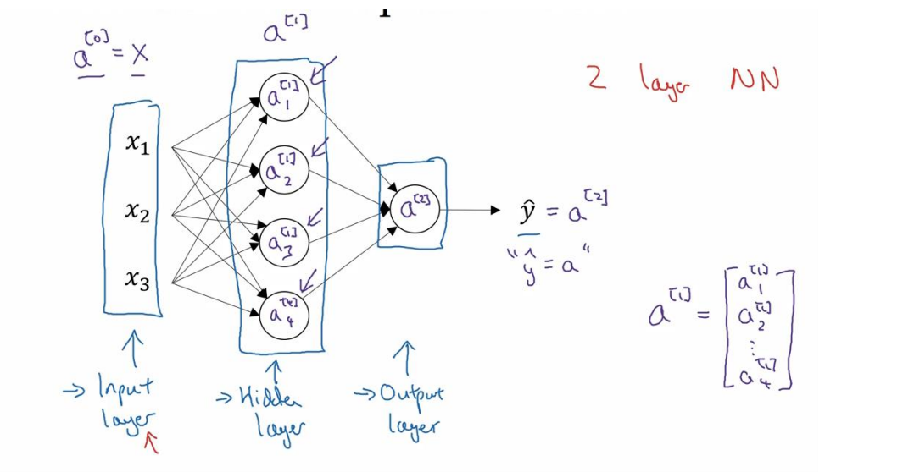
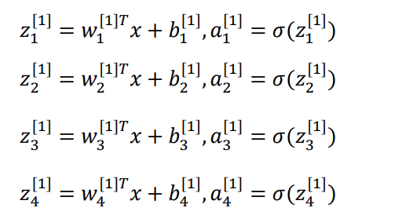
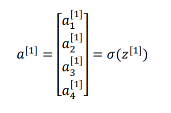
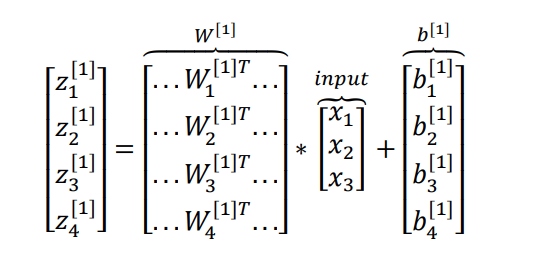
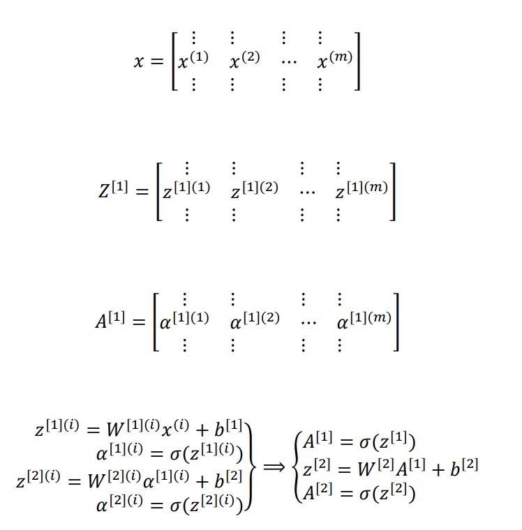
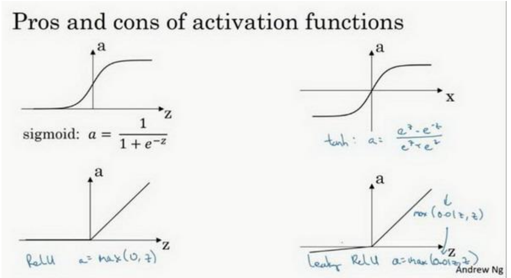
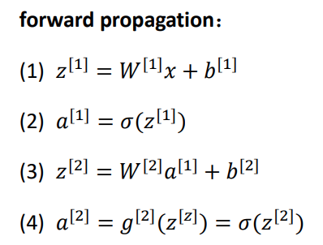
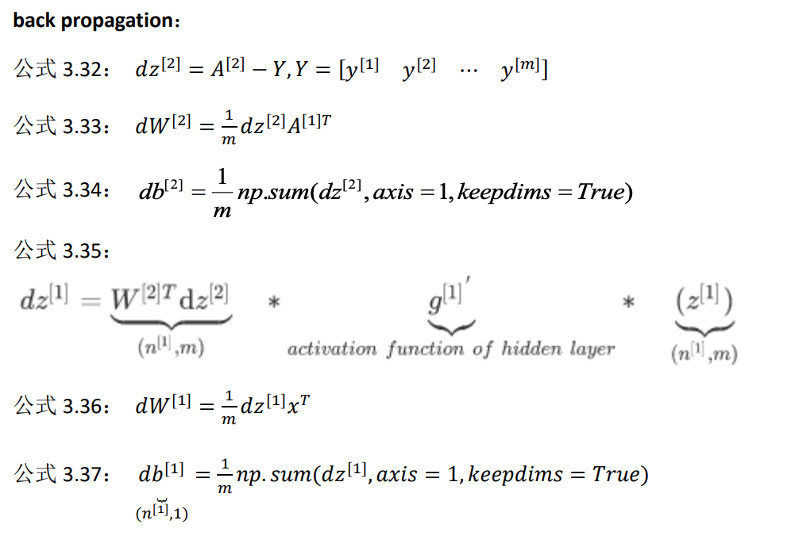

# 模型

神经网络可以看作是概率模型



x表示输入特征，a表示每个神经元的输出，W表示特征圈子，商标表示神经网络的层数（隐藏层为1），下标表示该层的第几个神经元。




## 单样本向量化

$$
z^{[n]}=w^{[n]}x+b^{[n]}\\
a^{[n]}=\sigma(z^{[n]})\\
$$





## 多样本向量化

在逻辑回归的多样本向量化中是矩阵x列向量。现在是矩阵x矩阵。



## 激活函数相关

1. sigmoid函数
   $$
   a = \sigma(z)=\frac{1}{1+e^{-z}}\\
   dz = a(1-1)
   $$
   
2. tanh函数
   $$
   a = tanh(z)=\frac{e^{z}-e^{-z}}{e^{z}+e^{-z}}\\
   dz = 1-a^2
   $$
   一般都用此函数，因为值域在[-1,1]之间，所以数据的均值为0而不是0.5这样下一层训练会容易一点。但是和sigmoid一样，在z特别大或者特别小的情况下，导数的梯度会变得特别小，最后就会接近于0。

3. relu函数
   $$
   a = max(0,z)\\
   dz = 0,1
   $$
   
4. leaky relu
   $$
   a = max(0.01,z)\\
   dz = 0.01,1
   $$
   

   


#### 总结

1. 在𝑧的区间变动很大的情况下，激活函数的导数或者激活函数的斜率都会远大于 0，在程序实现就是一个 if-else 语句，而 sigmoid 函数需要进行浮点四则运算，在实践中， 使用 ReLu 激活函数神经网络通常会比使用 sigmoid 或者 tanh 激活函数学习的更快。
2. sigmoid 和 tanh 函数的导数在正负饱和区的梯度都会接近于 0，这会造成梯度弥散，而 Relu 和 Leaky ReLu 函数大于 0 部分都为常数，不会产生梯度弥散现象。(同时应该注 意到的是，Relu 进入负半区的时候，梯度为 0，神经元此时不会训练，产生所谓的稀疏性， 而 Leaky ReLu 不会有这问题) 𝑧在 ReLu 的梯度一半都是 0，但是，有足够的隐藏层使得 z 值大于 0，所以对大多数的 训练数据来说学习过程仍然可以很快。


# 策略

现在我们看下这个浅层的神经网络和之前的logistic有什么不同。首先多了一个隐藏层，并且有多个神经元，相当于每个输入都要与这所有的神经元做连接。总之，就是多个logistic累积。在数学上比较优美的地方在于，相比于之前多个样本多个特征与单一的权重向量相乘，现在由于有多个神经元，相当于有多个权值向量，那么就变成了两个矩阵之间的乘。结构变复杂了，本质上还是WX+b.同样的损失函数为
$$
J(W^{[1]},b^{[1]},W^{[2]},b^{[2]})=\frac{1}{m}\sum_{i=1}^mL(\hat y,y)
$$


# 算法

同样适用梯度下降法







### 权重矩阵的初始化问题

1. w不能初始化为0.这样子所有的隐藏神经元都是对称的，意味着学到的东西也是一样的。

2. 可以随机初始化。

   ```python
   W1 = np.random.randn(2,2)*0.01
   b1 = np.zeros((2,1))
   W2 = np.random.randn(2,2)*0.01
   b2 = 0
   ```

   为什么要乘以一个0.01？因为W越大，那么Z越大，如果使用的是sigmoid函数的话梯度很小，下降很慢。所以我们希望W较小。

# 实现


